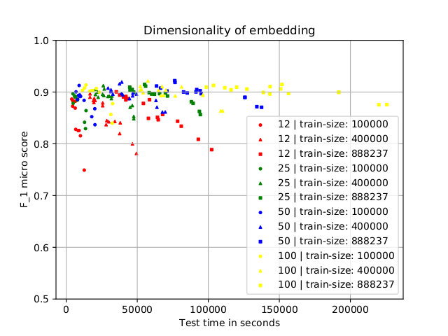

# w2v-pos-tagger

## Single Token Part-of-Speech Tagging using Support Vector Machines and Word Embedding Features

### 1 — Introduction

**w2v-pos-tagger** is a project submission to an NLP & IR class in *2017*. The task description
was as follows:



<p align="left">

 * Train a Part-of-speech tagger for the German language.
 * Use the [TIGER corpus](https://www.ims.uni-stuttgart.de/forschung/ressourcen/korpora/tiger/)
   as training set.
 * Use the [HDT corpus](https://corpora.uni-hamburg.de/hzsk/de/islandora/object/treebank:hdt)
   as test set.
 * Use the [STTS](http://www.sfs.uni-tuebingen.de/resources/stts-1999.pdf) as well as the
   [Universal tagset](https://universaldependencies.org/u/pos/) as classes.
 * Train a POS-tagger model on an
   [SVM](https://scikit-learn.org/stable/modules/generated/sklearn.svm.SVC.html)
   using an RBF kernel.
 * Write Precision, Recall and F<sub>1</sub> score metrics.
 * Compare the results to the pre-trained tagger of [spaCy](https://spacy.io/) 1.x and an
   [NLTK](https://www.nltk.org/) based tagger trained with the
   [ClassifierBasedGermanTagger](https://github.com/ptnplanet/NLTK-Contributions).
 * Describe the results in a [course paper](paper/pos_paper_funke.pdf).

A few choices of the task requirements were questionable, for example the demand of an SVM
classifier and the mandatory usage for a nonlinear kernel, also the requirement for different 
train/test corpora and the size of the test set itself (full corpus). However, this project stays
within the bounds of these constrains.

Defining a design for the feature engineering was part of the challenge. I decided for unigram word
vectors as input features for the SVM and applied a comprehensive hyperparameter search for 
embedding types, vector sizes and SVM hyperparameters. This simple, yet effective, approach of 
learning a hyperplane separation through the (RBF-transformed) embedding space gave an 
F<sub>1</sub> score of 0.919 for the best models. The approach demonstrates how well static unigram
word vectors can represent syntactic language features. The project is described in:

* **A. Funke**: *Single Token Part-of-Speech Tagging using Support Vector Machines and
  Word Embedding Features*. Course paper for "Natural Language Processing and Information
  Retrieval" (HHU 2017)  
  [paper/pos_paper_funke.pdf](paper/pos_paper_funke.pdf)

  **Abstract:**  
  *Part-of-speech tagging (POS) is a common technique in Natural Language Processing pipelines.
  It enriches a corpus with grammatical information which can be exploited not only for syntactic
  but also for semantic evaluation. In this paper we propose an SVM based POS-tagger trained
  on the TIGER corpus using word embeddings of small dimensionality as input data. The feature-set
  is based only on the token itself without context of surrounding words. A maximum F<sub>1</sub>
  micro score of 0.919 when tested on the HDT corpus could be achieved.*

</P>

### 2 — Setup

At first, set up a Python 3 environment, e.g. via conda:

```bash
conda create -n w2vpos python=3.6.*
conda activate w2vpos
```

Install pip dependencies and the German spaCy model:

```bash
pip install -r requirements.txt
python -m spacy download de
```

Download the required part-of-speech annotated corpora:

```bash
mkdir -p corpora

# TIGER
echo "Please view and accept the license agreement for the TIGER corpus."
xdg-open https://www.ims.uni-stuttgart.de/documents/ressourcen/korpora/tiger-corpus/license/htmlicense.html
curl https://www.ims.uni-stuttgart.de/documents/ressourcen/korpora/tiger-corpus/download/tigercorpus-2.2.conll09.tar.gz | tar xvz -C corpora

# HDT
curl -SL "https://corpora.uni-hamburg.de:8443/fedora/objects/file:hdt_hdt-conll/datastreams/hdt-conll-tar-xz/content?asOfDateTime=2016-02-17T15:38:47.643Z&download=true" | tar xvfJ - -C corpora
```

### 3 — Documentation

### ! will be updated soon !

<!--
1.
Zur Analyse der Tagsets kann das Programm corpora_analyser.py gestartet werden. Sowohl
TIGER als auch HDT verwenden ein Tagset, dass dem STTS (54 tags) sehr nahe kommt. Beide Corpora verwendet PROAV statt PAV.  Im TIGER Corpus fehlt PIDAT, dafür findet sich hier NNE als Mischung auf Normal-Nomen (NN) und Eigennamen (NE). Die NNE Tags kann man aber als Überbleibsel betrachten. Im Tiger/Negra-Corpus wird der Tag noch offiziell geführt. Bereits von v2.1 auf v2.2 wurden aber einige entfernt. Die verbliebenen NNE Tags folgen keiner Systematik. Daher habe ich sie als Bugs betrachtet und im folgenden durch NE ersetzt.
Der HDT Corpus enthält zwei Tagsets. Das STTS nahe Tagset hat ebenfalls kleinere Bugs. Im Folgenden habe ich PPOSSAT zu PPOSAT und VAIZU zu VVIZU korrigiert. Das zweite HDT-Tagset ist eine verkürzte Form des STTS mit folgendem Mapping:
    • ADJD → ADV
    • PDAT, PIAT, PIDAT, PWAT, PPOSAT, PRELAT → ART
    • NE, NN → N
    • APPO, APPR, APPRART → PREP
    • PWS, PRF, PRELS, PPER, PIS, PDS, PPOSS → PRO
    • VVIZU, VAFIN, VAIMP, VAINF, VAPP, VMFIN, VMINF, VMPP, VVFIN, VVIMP, VVINF, VVPP → V
Mir ist nicht bekannt, ob dieses Tagset einen eigenen Namen hat. Auf der Webseite des Hamburg Dependency Treesets findet man dazu keine Informationen.

Quellen:
    • http://www.ims.uni-stuttgart.de/forschung/ressourcen/lexika/TagSets/stts-table.html
    • http://www.ims.uni-stuttgart.de/forschung/ressourcen/korpora/tiger.html
    • https://corpora.uni-hamburg.de/hzsk/de/islandora/object/treebank:hdt
Nach corpora_analyser.py wird data_loader.py gestartet werden. Hierdurch werden die Original-Corpora verarbeitet und neu gespeichert, so dass dieser Prozess nicht mehrmals durchgeführt werden muss, da er etwas Zeit in Anspruch nimmt. Die Dateien TIGER_preprocessed.csv und HDT_preprocessed.csv werden nun erstellt.
2.
Für die Anwendung der Spacy und NLTK POS-Tagger wird zunächst NLTK mit dem TIGER Corpus trainiert. Hierfür wird nltk_tiger_trainer.py gestartet. Der Tagger wird zur späteren Nutzung in der Datei ./corpora/nltk_german_classifier_data_full.pickle gespeichert. Der Code für das Training basiert auf folgendem Tutorial:
https://datascience.blog.wzb.eu/2016/07/13/accurate-part-of-speech-tagging-of-german-texts-with-nltk/
Im Anschluss kann pos_tagger.py aufgerufen werden. Das Programm lässt den Spacy und den NLTK Tagger jeweils für TIGER und HDT laufen. Achtung: das Programm speichert das Tagging für die jeweilige Kombination je in einer Datei {CORPUS}_pos_by_{FRAMEWORK}. Der Schreibvorgang erfolgt satzweise durch Anhängen an das Dateiende. Die erzeugten Dateien sollten also vor einem erneuten Durchlauf des Programms gelöscht werden. Durch das Argument --dry_run ist auch eine Ausgabe auf der Konsole möglich.
Der NLTK-Tagger ist besonders auf dem HDT Corpus langsam. Hier braucht es etwas Geduld.
3.
Zur Evaluierung des POS-Taggings dient das Programm tag_evaluator.py. Das Programm ist leider ein bisschen langsam und müsste eigentlich noch mal auf Effizient hin umgeschrieben werden, aber dafür fehlt die Zeit und es funktioniert.
Das Programm berechnet für alle Klassen Precision, Recall und F1 Maß und stellt diese anschaulich dar. Die Metriken werden auch für die Summe aller True Positives, False Positives und False Negatives dargestellt berechnet, was der Menge aller Instanzen entspricht. Da über die Summe aller Klassen natürlich False Positives = False Negatives gilt, liefern alle Metriken hier das gleiche Ergebnis, nämlich die Accuracy (Anzahl korrekter Tags / Anzahl aller Tags).
Wie nach der Übung schon besprochen, könnte man den Code auch leicht umschreiben, so dass man die Wörter als Klassen betrachtet. Da sich für Wörter jedoch nicht zwischen False Positives und False Negatives unterscheiden lässt, könnte man nur die Anzahl der korrekten Tags im Verhältnis zu allen Tags für diese Wortklasse berechnen, also wieder nur die Accuracy. Dieses Maß ist jedoch fraglich um ein Ranking zu erstellen, da ein Wort, dass nur einmal vorkommt, entweder nur eine Accuracy von 1 oder 0 haben kann.
Zu guter Letzt wurden noch die Metriken für die Tag-Klassen (ungewichtet) gemittelt. Die Resultate werden auch jeweils in eine csv-Datei geschrieben.
Die Mittelung müsste eigentlich gewichtet über die Häufigkeit der Tags geschehen, um aussagekräftiger zu sein. Am aussagekräftigsten für einen POS-Tagger finde ich tatsächlich die einfachste Metrik, nämlich die Accuracy. Die anderen Metriken kommen ja eher aus dem Bereich der IR-Systeme, wo sie sicherlich auch Sinn machen. Für einen POS-Tagger finde ich die Unterscheidung zwischen Precision und Recall und das über F1 gemittelte Maß eher wenig hilfreich.
4.
Der in 3. beschriebene Prozess erzeugt auch direkt die Evaluierung für das Universal Tagset. Bei dem Mapping habe ich mich an dem von den Autoren des Papers vorgeschlagenen Mapping des TIGER Corpus auf das Universal Tagset orientiert:
https://github.com/slavpetrov/universal-pos-tags/blob/master/de-tiger.map
NNE wurde wieder heraus genommen und dafür PIDAT hinzu genommen:
https://github.com/slavpetrov/universal-pos-tags/blob/master/de-negra.map
Die Ergebnisse für das Universal Tagset sind deutlich im Vergleich zum STTS Tagset, was zu erwarten war. Da es weniger Tags gibt (also ein gröberes Clustering) ist auch die Fehleranfälligkeit geringer. Insgesamt annotiert Spacy präziser als NLTK, und ist dabei auch um Größenordnungen schneller.
b)
1.
Der Ansatz ist ausführlich im Paper beschrieben. Hier noch eine konkrete Anleitung:
custom_embedding_builder.py erzeugt 16 verschiedene word embeddings basierend sowohl auf dem TIGER als auch dem HDT Corpus. Verwendet wird das Word2Vec Modell aus Gensim. Falls Training und Testing auf dem HPC ausgeführt werden sollen, ist es notwendig die Wortvektoren aus der Gensim eigenen Klasse KeyedVectors in ein Standard Python dictonary zu konvertieren. Mir war es jedenfalls nicht möglich, Gensim auf dem HPC zu installieren. Diese Konvertierung wird durch gensim_converter.py durchgeführt. Für die lokale Anwendung ist sie nicht erforderlich. Bei Training und Test muss dann allerdings das --gensim flag gesetzt werden.
Nach dieser Vorarbeit kann mit svm_tagger_train.py das Training für ein Modell gestartet werden. Parameter des Modells können wieder als Kommandozeilen-Argumente gesetzt werden. Zur Auswhl stehen:
--train_size <int>
--C <float>
--cache_size <int>
--max_iter <int>
--kernel {'linear', 'poly', 'rbf'}
--shrinking | --no-shrinking
--scale | --no-scale
--lowercase | --no-lowercase
--embedding_size {12, 25, 50, 100}
--embedding_model {'cb', 'sg'}
--gensim | --no-gensim
--verbose | --no-verbose

Das Programm speichert das Modell (*_clf.pickle), ein Infofile über verwendete Parameter (*_options.json) sowie bei Bedarf den Scaler (*_scale.pickle).
Zum Testen wird svm_tagger_test.py aufgerufen.  Beim Aufruf muss das zu testende Modell angegeben werden. Parameter sind:
--test_size <int>
--model_dir <path to directory of model> (optional)
--model_file <name of model without `_clf.pickle` suffix>
Beispiel:
python svm_tagger_test.py --model_file 2017-12-27_15-18-26-774110_custom_sg_50
Zusätzlich zur Ausgabe der F1 Scores auf der Konsole wird auch eine *_testresult_*.json Datei mit den Ergebnissen gespeichert, die im Anschluss in der Evaluierung ausgewertet werden können. Der Integerwert am Dateinamenende kennzeichnet die verwendete Test-Size, wobei 0 einen Test über den vollen Korpus repräsentiert.
Die gesammelten Testresultate können für die Evaluierung automatisiert aufbereitet, geplottet und tabellarisch gruppiert und sortiert auf der Konsole ausgegeben werden. Hierzu
svm_tagger_evaluator.py starten.  Bei Bedarf den Speicherort der testresult-files angeben.
--model_dir <path to directory of testresult files> (optional)
//-->
