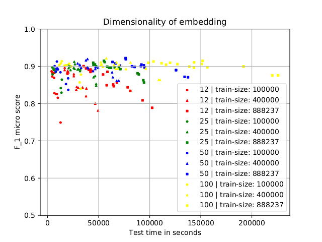

# w2v-pos-tagger

#### Single Token Part-of-Speech Tagging using Support Vector Machines and Word Embedding Features


## Content

1) [Introduction](#1--introduction)
2) [Setup](#2--setup)
3) [Usage](#3--usage)
   1) [Corpus Analysis and Normalization](#31-corpus-analysis-and-normalization)
   2) [Baselines](#32-baselines)
   3) [SVM-Tagger](#33-svm-tagger)
4) [Model Selection](#4--model-selection)


## 1 — Introduction

**w2v-pos-tagger** is a project submission to an NLP & IR class in 2017. The task description
was as follows:



<p style="text-align: left;">

 * Train a part-of-speech tagger for the German language.
 * Use the [TIGER corpus](https://www.ims.uni-stuttgart.de/forschung/ressourcen/korpora/tiger/)
   as training set.
 * Use the [HDT corpus](https://corpora.uni-hamburg.de/hzsk/de/islandora/object/treebank:hdt)
   as test set.
 * Map the [STTS](http://www.sfs.uni-tuebingen.de/resources/stts-1999.pdf) annotations to the
   [Universal tagset](https://universaldependencies.org/u/pos/) and use the latter as labels.
 * Train a POS-tagger model on an
   [SVM](https://scikit-learn.org/stable/modules/generated/sklearn.svm.SVC.html)
   using an RBF kernel.
 * Write Precision, Recall and F<sub>1</sub> score metrics.
 * Compare the results to the pre-trained tagger of [spaCy](https://spacy.io/) 1.x and an
   [NLTK](https://www.nltk.org/) based tagger trained with the
   [ClassifierBasedGermanTagger](https://github.com/ptnplanet/NLTK-Contributions).
 * Describe the results in a [course paper](paper/pos_paper_funke.pdf).

A few choices of the task requirements were questionable, for example the demand of an SVM
classifier and the mandatory usage for a nonlinear kernel, also the requirement for different 
train/test corpora and the size of the test set itself (full corpus). However, this project stays
within the bounds of these constrains.

Defining a design for the feature engineering was part of the challenge. I decided for unigram word
vectors as input features for the SVM and applied a comprehensive hyperparameter search for 
embedding types, vector sizes and SVM hyperparameters. This simple, yet effective, approach of 
learning a hyperplane separation through the (RBF-transformed) embedding space gave a weighted
F<sub>1</sub> score of 0.914 for the best models. The approach demonstrates how well static unigram
word vectors can represent syntactic language features. The project is described in:

* **Andreas Funke**: *Single Token Part-of-Speech Tagging using Support Vector Machines and
  Word Embedding Features*.   
  Course paper for "Natural Language Processing and Information
  Retrieval" (HHU 2017).

  **Abstract:**  
  > Part-of-speech tagging (POS) is a common technique in Natural Language Processing pipelines.
  It enriches a corpus with grammatical information which can be exploited not only for syntactic
  but also for semantic evaluation. In this paper we propose an SVM based POS-tagger trained
  on the TIGER corpus using word embeddings of small dimensionality as input data. The feature-set
  is based only on the token itself without context of surrounding words. A maximum F<sub>1</sub>
  micro score of 0.919 when tested on the HDT corpus could be achieved.
  > 
  > → [paper/pos_paper_funke.pdf](paper/pos_paper_funke.pdf)

</P>


## 2 — Setup

Create a conda environment:

```bash
conda env create -f environment.yml
conda activate w2vpos
```

Install the python package:

```bash
python setup.py develop
```

Download the required part-of-speech annotated corpora:

```bash
# TIGER
echo "Please view and accept the license agreement for the TIGER corpus."
xdg-open https://www.ims.uni-stuttgart.de/documents/ressourcen/korpora/tiger-corpus/license/htmlicense.html
curl https://www.ims.uni-stuttgart.de/documents/ressourcen/korpora/tiger-corpus/download/tigercorpus-2.2.conll09.tar.gz | tar xvz -C corpora/tiger-conll

# HDT
curl -SL "https://corpora.uni-hamburg.de:8443/fedora/objects/file:hdt_hdt-conll/datastreams/hdt-conll-tar-xz/content?asOfDateTime=2016-02-17T15:38:47.643Z&download=true" | tar xvfJ - -C corpora
```

In order to train an NLTK based reference model one additional dependency is needed:

```bash
git clone git@github.com:ptnplanet/NLTK-Contributions.git lib/NLTK-Contributions
cp lib/NLTK-Contributions/ClassifierBasedGermanTagger/ClassifierBasedGermanTagger.py src/w2v_pos_tagger/
```


## 3 — Usage


### 3.0 TL;DR

```bash
# describe the copora and their labels
w2vpos analyse

# preprocess the corpora
w2vpos preprocess

# train an NLTK baseline model
w2vpos train --baseline

# tag the corpora with spaCy and NLTK
w2vpos tag --baseline

# evaluate the reference inference
w2vpos evaluate --baseline

# learn distributed word vectors as features for the classifier
w2vpos train --word2vec

# train a SVM classifier leveraging those features
w2vpos train --svm --model my_first_pos_tagger

# tag the HDT corpus with an SVM model
w2vpos tag --svm --model my_first_pos_tagger

# evaluate the performance of all trained models
w2vpos evaluate --svm --model my_first_pos_tagger
```


### 3.1 Corpus Analysis and Normalization

To analyse the tagset of both corpora, run

```bash
w2vpos analyse
```

To normalize and fix a few issues in the corpora and to persist the results run

```bash
w2vpos preprocess
```

This will cache the pre-processing as csv files in `corpora/out/`.

Additionally, the script will map STTS to the Universal Tagset according to
this mapping:
https://github.com/slavpetrov/universal-pos-tags/blob/master/de-tiger.map


### 3.2 Baselines
 
#### 3.2.1 Tagging with spaCy and NLTK

Before training our own SVM model we will evaluate the POS-tagging efficiency of common
NLP frameworks such as `spaCy` and `NLTK`. In order to provide a comparable NLTK based
tagger we will train it first.

```bash
w2vpos train --baseline
```

The newly trained NLTK tagger will be saved to `corpora/out/nltk_german_classifier_data.pickle`.

To apply the spaCy and NLTK part-of-speech tagging run

```bash
w2vpos tag --baseline
```

The annotations will be saved to `out/annotations/`.

#### 3.2.2 Baseline Evaluation

```bash
w2vpos evaluate --baseline
```

will measure the performance of the newly tagged corpora against the ground truth
on several related metrics:

* accuracy
* precision (weighted)
* recall (weighted)
* F<sub>1</sub> measure (weighted)

The evaluation results are saved to `corpora/out/evaluation/`.


### 3.3 SVM-Tagger

After these preparations we should have a good understanding of the dataset
and the performance of comparable approaches. We can now build our own SVM classifier.

#### 3.3.1 Learning Custom Word Vectors

Since we will be using word vectors as features for the SVM we will learn an embedding
space from the combined TIGER and HDT corpus by applying good old word2vec.

```bash
w2vpos train --word2vec
```

will generate 16 (default) different word embeddings using the following hyperparmeter sets:

| Architecture | Case folding | Dimensionality |
|--------------|--------------|----------------|
| cbow         | none         |       12       |
| cbow         | none         |       25       |
| cbow         | none         |       50       |
| cbow         | none         |       100      |
| cbow         | lowercasing  |       12       |
| cbow         | lowercasing  |       25       |
| cbow         | lowercasing  |       50       |
| cbow         | lowercasing  |       100      |
| skip-gram    | none         |       12       |
| skip-gram    | none         |       25       |
| skip-gram    | none         |       50       |
| skip-gram    | none         |       100      |
| skip-gram    | lowercasing  |       12       |
| skip-gram    | lowercasing  |       25       |
| skip-gram    | lowercasing  |       50       |
| skip-gram    | lowercasing  |       100      |

The hyperparameters can be customized. For details:

```bash
w2vpos train --word2vec --help

# optional arguments:
#   -h, --help            show this help message and exit
#   -a {cb,sg} [{cb,sg} ...], --architecture {cb,sg} [{cb,sg} ...]
#                         Choice(s) for word2vec architecture: cbow ('cb')
#                         and/or skip-gram ('sg').
#   -c {none,lower} [{none,lower} ...], --case-folding {none,lower} [{none,lower} ...]
#                         Choice(s) for case folding: no case folding ('none')
#                         or lowercasing ('lower').
#   -d DIMENSIONALITY [DIMENSIONALITY ...], --dimensionality DIMENSIONALITY [DIMENSIONALITY ...]
#                         Choice(s) for embedding sizes: list of int > 0.
#   -e EPOCHS, --epochs EPOCHS
#                         Number of word2vec training iterations.
```

The embeddings are saved to `corpora/out/embeddings/`.

The original project trained the embedding for 5 epochs. You may want to increase
the number of iterations over the corpus for better performance:

```bash
w2vpos train --word2vec --epochs 30
```

#### 3.3.2 Train a Support Vector Classifier

Now, let's train our model. We will use the TIGER corpus as training set.

```bash
w2vpos train --svm --model my_first_pos_tagger
```

The hyperparameters of the SVM can be partly customized. You can chose one of the 
pretrained words embeddings and other training parameters. Start with the defaults
and then find additional information in the script's help.

```bash
w2vpos train --svm --help

# optional arguments:
#   -h, --help            show this help message and exit
#   --verbose
#   --no-verbose
#   -e EMBEDDING, --embedding EMBEDDING
#                         Path to a pretrained embedding. Will override
#                         architecture and dimensionality.Make sure to set the
#                         `--lowercase` flag if the embedding was trained on a
#                         lower-cased vocabulary.
#   -a {cb,sg}, --architecture {cb,sg}
#   -d DIMENSIONALITY, --dimensionality DIMENSIONALITY
#   --lowercase
#   --no-lowercase
#   --train-size TRAIN_SIZE
#                         Train only on a slice of the trainset with length
#                         `train_size`.
#   --shrinking
#   --no-shrinking
#   --scale               Normalize the feature vectors.
#   --no-scale
#   --C C                 Soft-margin parameter.
#   --cache-size CACHE_SIZE
#                         Specify the size of the kernel cache (in MB).
#   --max-iter MAX_ITER   Limit the number of iterations.
#   --kernel {linear,poly,rbf}
#   -m MODEL, --model MODEL
#                         Specify a custom name for the model. Otherwise a
#                         unique model id will be created.
```

#### 3.3.3 Corpus annotation

We can now tag the HDT corpus using our SVM models.

```bash
w2vpos tag --svm --model my_first_pos_tagger
```

The value for `--model` can either be a relative or an absolute path containing
a single model, usually a sub-folder of `out/models/`.

The model will predict the Part-of-Speech-tag for each token and the annotations will
be saved to `out/annotations/`.

#### 3.3.4 Evaluate annotations

```bash
w2vpos evaluate --svm --model my_first_pos_tagger
```

will evaluate all previously annotated corpora, print and save a
summary to `out/evaluation`.

#### 3.3.5 Plot model scores

under construction


## 4 — Model Selection

A detailed overview over a large collection of models that was evaluated
for the model selection can be found in this document:

> [detailed_results_all_tests.md](detailed_results_all_tests.md)

The best model from this selection with a weighted F<sub>1</sub> score of 0.914 is available here:

> https://drive.google.com/open?id=1CnyybkCYSXC7K4s8l1XGl0wX3Nd81qRo
